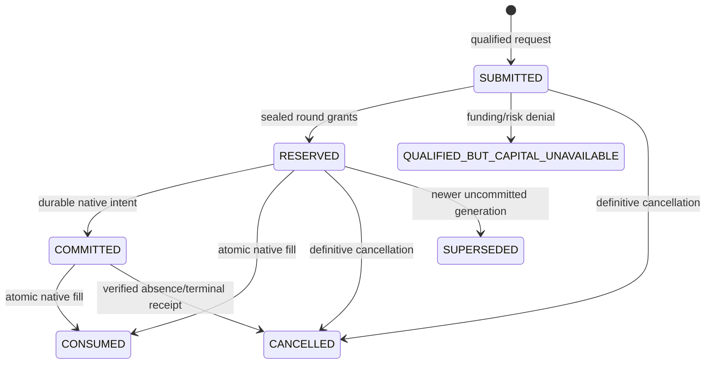

# Isolated shared-capital PAPER allocator

This feature is built for later integration. It is absent from the operational
entrypoint, supervisor, lane runners, native sleeves, providers and deployment
configuration. It does not merge, deploy, migrate the current runtime, reseed a
PAPER epoch or run CAPACITY, RECOVERY or AUTONOMY.

Source commit: `b577cc1c67f4d64f887b430f5e933f376b607dc2`.
Source tree: `d6f5964acaf2269571a8446a8f74fbca00c4a69e`.
Feature branch: `feature/shared-capital-pool`.
Worktree: `/root/Documents/Codex/2026-10-06/the-meme-machine-parallel-shared-capital/feature-worktree`.
The worktree uses its own bare clone, so operational worktree registration and
branch refs are also isolated. See [isolation evidence](feature_validation/shared-capital/isolation.json).

The pre-existing operational checkout had modifications to
`meme_machine/solana_maintenance_state.py` and
`tests/test_production_maintenance_arbiter.py`. Their initial diff SHA256 was
`202391fb31a838a8d58f95f2edd581074c93a8587b7f47369af7451fbe130313`.
Only read-only Git/source inspection was performed there. No deployed checkout,
provider configuration, PAPER database, service, acceptance controller or portfolio
was opened or changed. All allocator state in validation is synthetic temporary state.

## Capital authority

`meme_machine.shared_capital.CapitalAuthority` owns one durable USD ledger. It has
no inception method: a new database remains `NOT_INITIALIZED` until an explicit,
reconciled preserved-epoch migration plan is installed. Retrying that same install
returns its original receipt; another install cannot replace the epoch.

Let E = inception capital + attributed realized P&L − shared costs; D = remaining
deployed basis; C = actual cash; R = active reservation totals; P = incremental
pending authoritative commitment totals; O = required funding obligations.

```text
C + D = E
free_cash = C − R − P − O >= 0
D + R + P + O <= E = authoritative_fundable_capital
```

Reservation amounts include basis, transaction cost headroom and required
settlement headroom. A native delivery already backed by a reservation or deployed
position is reported with that backing and is counted once in this equation.
An incremental native commitment is counted in P. Unknown commitment amounts or
backing stop migration. Borrowed lane cash and marks cannot create fundable capital.

Native entry fees already capitalized into the original basis retain that accounting
treatment. They can consume the explicitly reserved transaction-cost buffer without
enlarging the approved strategy principal. Cash spent cannot exceed principal plus
that buffer; possible capitalized costs count against gross exposure headroom.
Scaling retains its original full-basis ceiling, including capitalized fees.

Sizing, funding and aggregate risk limits are separate. Default directional sizing
is `effective_family_equivalence`: the verified existing realized **native** family
sizing base, original 500-bps target and native integer rounding are retained.
`CapitalRequest.native_sizing` binds the realized native-unit base, fresh USD
conversion and native journal hash into the recorded qualification evidence.
The original filled native basis is retained for scaling. Currency-price changes
do not silently replace that base with $125 at a new exchange rate.

The explicit alternative is `shared_realized_equity`. Only this configured choice
uses E to form the 500-bps native target. At the unchanged $500 / four-$125 inception
and an unchanged conversion, these requests are $25 versus $6.25: four times the
individual trade risk. Meteora and Ramses always keep their native requested amounts
and liquidity/capacity rules. They have no directional target helper.

Unrealized gains never enter E or the realized native compounding base. New
allocation requires fresh, valid USD conversion evidence and current marks for
every open portfolio position. Current risk exposure uses max(basis, valid mark);
losses lower min(E, marked equity), which forms aggregate risk ceilings. Held and
requested transaction costs and required obligations further reduce risk headroom.
Missing marks block new funding while existing safety management and authoritative
settlement remain available. A drawdown limit stops new risk; it is not a guaranteed
maximum drawdown for positions already open.

## Durable lifecycle and deterministic competition



Each request binds epoch, request ID, round, regime, candidate, generation,
qualification hash, funding kind and target lifecycle. The complete native sizing,
requested amount, minimum amount, costs, liquidity/execution/strategy limits,
quality, duration and scaling evidence must match the recorded strategy evidence.
Default requests are all-or-none; a lower minimum is accepted only when the native
strategy evidence explicitly allows it. A new request cannot use an existing
position ID to bypass an asset fence. Directional continuation/safety cannot be
used as an alternative route for an unapproved add.

Requests are submitted without granting money. A round has a fixed cutoff and
explicit manifests from Pump Current, Pump Survivor, Pons Current, Pons Survivor,
Meteora and Ramses. Empty manifests are valid. Every submitted request must appear
in its manifest. A sealed regime cannot submit late; allocation cannot run until
all six manifests are present. There is no timing-based or timeout-based winner.
An unavailable lane requires a definitive coordinator-owned empty manifest or a
definitive cancellation, not an inferred empty lane.

Management and required obligations have first authority; existing reservations
and commitments retain their cash claims. Competing new claims rank safety,
continuation/scaling, then qualified new opportunities. Within a rank, bounded
performance/opportunity/risk scores decide priority. A SHA256 of epoch, round,
regime, candidate, generation and request ID breaks ties. The entire sealed order,
decisions, limiting constraints and denial reasons are durable and replayable.

Every mutation uses `BEGIN IMMEDIATE`, reads authoritative state, applies all
constraints, reconciles, and atomically writes its command, result, state hash and
projection using SQLite WAL with `synchronous=FULL`. Different processes cannot
grant from a cached balance. Exact fixed-point Decimal ledger arithmetic is
independent of the caller's Decimal context. Scores use rational/integer arithmetic.
Only display statistics use binary floats. Journal rows are append-only. Startup
replays every event and compares command results and resulting state hashes.

An identical **operation ID and original event envelope**, including original
effective time, is an idempotent retry even after a lost reply/restart. A changed
payload under that ID fails closed. A replay under another request identity or
native sequence cannot double-spend or settle again. Producers must persist the
operation/event envelope, rather than stamp retries with their delivery time.
A commitment binds its native lifecycle before position creation. Native
reservation/intent acknowledgements retain that binding and advance their sequence
without claiming cash again; a conflicting lifecycle cannot fork the request. A newer generation releases an uncommitted superseded reservation;
an uncertain committed native intent stays funded. Verified cancellation/absence
releases it. An ordered authoritative terminal position receipt also cancels its
unused continuation/scaling claims. There is no blind lease expiry.

## Risk and allocation policy

RiskPolicy centralizes all ceilings. Feature defaults are illustrative future-owner
parameters, not authorization to activate these economics:

| Constraint | Default |
|---|---:|
| Portfolio aggregate | 90% of risk base |
| Regime base / absolute maximum | 50% / 60% |
| Family maximum (Current + Survivor together) | 65% |
| Canonical economic asset / lineage key | 15% |
| Crypto beta | 85% |
| Solana / Robinhood factors | 70% / 70% |
| Directional / LP factors | 80% / 70% |
| Adaptive multiplier | 0.8–1.2 |
| Cooldown / hysteresis / maximum step | 3600 s / 250 bps / 500 bps |
| Recent / reference evidence | 7 / 30 days |
| Confidence priors | 20 completed trades; $500 capital-days |
| New-risk drawdown stop | 20% |

Budgets reserve zero cash. Regime, family, asset, factor, total risk, free cash,
transaction cost, strategy cap, liquidity, execution and staged limits all bind a
grant. Correlated exposures count against every applicable factor. Asset mappings
must use canonical chain/asset identities and Pump/PumpSwap lineage aliases;
multiple keys never increase diversification credit. Existing positions can exceed
entry ceilings through market movement; the allocator neither sells them nor
changes their alpha exits to restore a budget.

Performance is derived from attributed terminal ledger samples: equal-position
realized expectancy; net P&L/deployed capital; profit factor; realized drawdown and
downside; right-tail contribution; costs; return per capital-day. Number of completed
trades and observed capital-time independently limit confidence. Recent evidence
has one-quarter weight against the longer reference; inconsistent windows halve
confidence. Sparse or unavailable historical evidence shrinks toward neutral.
Samples and allocation-change details each retain at most 512 items. Exact monetary
history, request identities and delivery receipts remain authoritative epoch-lifetime
facts; they must be preserved by the future backup/retention integration.

Opportunity inputs are existing qualified flow, optional native quality, current
execution/liquidity capacity and optional native expected duration. Missing optional
quality/duration is neutral. Scores penalize current regime concentration. These
inputs change capital priority, never discovery or qualification rules. A deteriorating
lane has a bounded positive budget and can submit improved evidence later. No cash
is reserved for a fairness floor, and there is no forced equality. The floor preserves
observation, qualification, unfunded receipts and recovery capability; under continual
overload it does not promise every weak opportunity a grant.

Allocation-score changes never generate exits. Capital rotates on cancellation,
realization and ordinary strategy settlement. Approved scaling invokes the existing
native `scale_budget` contract with the preserved native original basis: >=2x
high-water, first realization, 900-s persistence, high proximity, all fresh strategy
and execution gates, one add, 2.5% target, original-basis half cap and 7.5% strategy
ceiling. It then passes through all shared funding/risk limits. No future add is
pre-reserved. Pons ongoing requalification and all nine approved strategy changes
remain byte-identical.

## Economic comparison

[Full results](feature_validation/shared-capital/economics.json) include all ten
identical deterministic tapes, each tape hash, by-regime P&L/cost/grant/denial
attribution, realized return, marked drawdown, volatility/downside, peak basis and
marked risk, asset/regime concentration, turnover, capital-time efficiency and
allocation paths. The comparison uses the actual production reducer; SQLite
durability is tested separately. The hard comparator adds the exact historical
$125-family cash ceilings to the same execution/risk controls. Its cash boundary
is independently checked against `PortfolioAccounting.reserve`. This is a controlled
capital comparison with scripted, already-qualified after-cost native outcomes,
not a historical alpha backtest or a profitability/acceptance claim. No parameter
optimization is performed.

Scenarios: one lane dominates; leadership rotates; several lanes are strong; a weak
lane recovers; a small-sample streak; a strong lane enters drawdown; correlated
arrivals; liquidity constrains a leader; prolonged idle capital; a rare right-tail
winner. Scenario means have equal weight and do not imply a production forecast.

| Metric | Hard sleeves | Shared fixed | Shared adaptive |
|---|---:|---:|---:|
| Mean utilization | 36.78% | 49.22% | 49.40% |
| Mean stranded idle-sleeve cash | 312.32 USD | 0.00 USD | 0.00 USD |
| Qualified unfunded | 1321 | 822 | 867 |
| Mean realized return | 15.47% | 19.39% | 19.97% |
| Worst marked drawdown | 11.41% | 21.04% | 21.39% |
| Peak regime exposure / realized equity | 32.45% | 53.79% | 55.81% |
| Mean capital-time utilization | 39.42% | 52.85% | 53.01% |
| Budget changes | 0 | 0 | 22 |

The checked-in comparison recommends **shared fixed soft budgets** for later owner
review. Adaptive activation needs >0.5 percentage-point mean utilization improvement,
no return deterioration, at most 1 percentage point extra worst drawdown, at most
5 points extra peak regime concentration, and no new zero-grant regime that fixed
budgets funded. This feature does not authorize activation of either policy.

The wider shared budget also raises aggregate downside compared with hard sleeves.
Owner selection of risk caps is therefore still required. Portfolio-equity sizing
is measured separately and remains disabled by default: it substantially increases
individual requested amounts and can produce much higher marked concentration
around a right-tail winner. Sharing capital is not permission for that sizing change.

## Migration and later integration

`plan_migration` reads only a supplied preserved-epoch backup in a coherent read-only
transaction, replaying the existing accountant. There is no current-runtime migration
command. Native journals must first be reconciled on the isolated backup, not guessed.
The explicit manifest supplies all six strategy contracts, each position's regime,
canonical economic keys, original native/USD reference basis, partial/add status,
known capital-time, reservation breakdowns, cursor mappings, retired attribution,
pending delivery backing and additional required obligations.

The plan retains the source receipt/hash, source journal frontier, full replayed
snapshot, original positions, realized/retired history, native alias inventory and
alias issuance/retirement frontiers, pending bodies and mapping. Missing positions,
reservations, cursors or pending commitments fail closed. Retired totals must reconcile
exactly by family; unknown retired capital-time is not invented as confidence. An
existing position retains its original identity and basis. Import is one atomic event
into a **new** allocator database and never changes the source database. Pending
delivery acknowledgements cannot erase a still-backed hold. Alias allocation continues
the original durable counter and rejects retired/cross-epoch native identities.

After current CAPACITY, the remaining procedure is:

1. Identify and record the exact **accepted post-CAPACITY operational commit/tree**
   and acceptance evidence. The source above is not a substitute for that commit.
2. Rebase this feature onto that exact commit in another clean integration worktree;
   resolve genuine conflicts only. Preserve strategy/provider bytes and all nine changes.
3. Wire one coordinator to native observation/qualification and capital request
   boundaries for all six regimes. Bind original native sizing/valuation proofs and
   deterministic operation envelopes. Remove hard cash admission from native sleeves
   while retaining their strategy sizing and economic attribution. Native funding
   receipts must be distinguished from P&L; no book may reseed or count a grant as profit.
4. Wire native reserve/intent/entry/mark/partial/add/exit acknowledgements, preserved
   native aliases/cursors, definitive cancellation, all-six round manifests, and fresh
   portfolio valuation. Required management must remain independent of discovery and
   incomplete allocation rounds. A supervisor restart must reconstruct authoritative
   commitments before admitting requests.
5. Extend operational backup, retention and read-only reporting to the new allocator
   database and epoch-lifetime receipts. Benchmark journal replay and maintenance at
   the accepted epoch's size. This isolated feature does not certify future runtime
   storage/CPU capacity. Central authority owns those records; lanes cannot delete
   them or use local balances as funding authority.
6. Rerun allocator, process/concurrency/restart/property, migration, ten-scenario
   economics, nine-change/strategy equivalence and FAST/OPERATIONAL suites.
7. On the verified preserved PAPER backup, build and reconcile a deterministic plan
   against actual native books and pending deliveries, import into a new DB twice to
   prove idempotence, interrupt/restart the import, and compare all balances/identities.
   Resolve every unknown commitment before switching a future candidate's authority.
8. Owner explicitly chooses aggregate caps, factor mappings and sizing basis. Default
   recommendation is fixed budgets and native effective sizing equivalence. Adaptive
   policy needs better evidence and an explicit later activation decision.
9. Freeze a new candidate with exact source/tree, policy/config hashes, migration
   receipt and test evidence. Perform the fresh acceptance required by this changed
   economic allocator. Current CAPACITY does not certify the future feature.

## Validation and recovery

Run offline with CPython 3.12.14 and the pinned requirements:

The existing OPERATIONAL alpha-equivalence test reads preserved historical commit
`3c9553afb3caa92ab5f3db769f870df033a9630f`. A single-branch source clone can omit
that object; fetch it into the isolated clone before testing. The recovery bundle
retains it. This is a repository-history requirement, not market-provider access.

```sh
git fetch origin 3c9553afb3caa92ab5f3db769f870df033a9630f
python -m unittest tests.test_shared_capital tests.test_shared_capital_concurrency \
  tests.test_shared_capital_recovery tests.test_shared_capital_migration \
  tests.test_shared_capital_strategy tests.test_shared_capital_performance \
  tests.test_shared_capital_economics
python -m experiments.shared_capital --output feature_validation/shared-capital/economics.json
python -m experiments.shared_capital_race
python -m operational.tests FAST
python -m operational.tests OPERATIONAL
```

The repository suites forbid market network I/O and use temporary fixtures. Focused
tests cover all six regimes, all 15 pairs and all 63 nonempty subsets, six concurrent
processes, conflicting identities, stale generations, deterministic reversed arrival,
idempotent duplicate/lost-reply delivery, process death before/after commit, partial
settlement, cancellation, staged adds, exact reconciliation and migration. Seeded
generated command sequences repeatedly reconcile and reopen the authority.
The supplemental cash-race experiment also allocates each of the 15 pairs from two
independent SQLite authority connections and checks identical receipts and restart
conservation; it does not rely on one object's in-process mutex.

See [validation receipt](feature_validation/shared-capital/validation.json) for final
counts and baseline/environment failures, and
[source equivalence](feature_validation/shared-capital/source-equivalence.json) for
the preserved strategy, runtime, provider and operational bytes.
[GitHub CI comparison](feature_validation/shared-capital/github-ci.json) records the
same nine failures and two errors in existing storage-guard fixtures on the source
and feature commits: the guard requires root-owned configuration, while the GitHub
runner creates non-root-owned fixtures. The 54 allocator tests introduce no new
CI failure. Local FAST and OPERATIONAL pass under the pinned root verification
environment. No guard, fixture or failure threshold is relaxed by this feature.
Publication records
the feature commit/tree/parent, clean worktree, independent GitHub readback and a
verified recoverable Git bundle. Only `feature/shared-capital-pool` is pushed.
