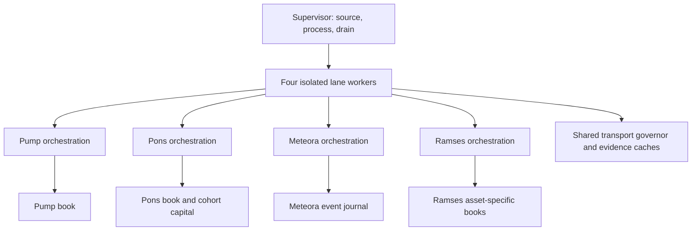

# Non-market end-to-end certification audit

**Verdict: NOT CERTIFIED.** This report records implemented repairs, reproducible component evidence, and failed certification gates. It does not assert the requested four-lane end-to-end/restart success standard. Absence of natural trades is not a failure, and none of the engineering gaps below is classified as natural-market-only.

## Exact source and evidence scope

Audit date: 2026-09-22 UTC. Repository: `levonmendall/The-Meme-Machine`.

| Role | Exact identity | Meaning |
|---|---|---|
| `main` at reconstruction | `54712c4c6470cc4dc267888f934bd693aac030d0` | Placeholder; not the four-lane integration |
| Canonical integration base | `fb94608aa1db7bc7c8468e132070871b0ea718bd` | PR #99 merged into `cert/profitability-persistence-edge-current-v1` |
| First repaired candidate | `299c7d7ed507af7ef50d148630757cb5c10300a6` | Exact local and hosted component/crash/resource evidence |
| Second repaired runtime candidate | `9ee589cd8f3c9459dce45a6d0532aa36251fa3ae` | Adds Ramses retry/authority repairs, CI assertion repair, historical inventory, honest manifest scope |
| Final evaluated runtime candidate | `76f06834011eb3ef6cac1fed5b31a094cc7d5a1b` | Adds historical exposure admission quarantine and original-policy book replay; this report is delivered in a subsequent documentation-only commit |
| Repair PR | [#100](https://github.com/levonmendall/The-Meme-Machine/pull/100) | Draft; no merge/promotion performed |
| Prior composed deterministic run | [35789882265](https://github.com/levonmendall/The-Meme-Machine/actions/runs/35789882265) | Historical component suites on `2c9de961dbddbd0cbe66c774cf16b98329b1317e`; not end-to-end certification |
| Second repaired hosted run | [35796387623](https://github.com/levonmendall/The-Meme-Machine/actions/runs/35796387623) | 1,363 native tests, 90 supervisor tests, crash matrix, resources, digest-pinned historical inventory passed; connectivity blocked |
| Final evaluated hosted run | [35797187822](https://github.com/levonmendall/The-Meme-Machine/actions/runs/35797187822) | Exact runtime candidate above; final status recorded in the evidence addendum |
| First repaired hosted run | [35795249808](https://github.com/levonmendall/The-Meme-Machine/actions/runs/35795249808) | Component, ledger crash, resources passed; connectivity skipped due to active competing job |

The canonical manifest already contained the newest four separately verified strategy heads at reconstruction; no strategy recomposition was required. The runtime is **four pinned checkouts plus operational overlays**, not the root repository's old Pump runtime. `certification/sources.json` is the machine-readable selection authority. Previous labels saying “final integrated deterministic passed” referred to component suites, not the broader standard requested here; this ambiguity is repaired in the manifest.

The table below pins the lane source, strategy label, and policy identity. Full selected source-file hashes remain in `sources.json`. Normalized overlay bytes are checked against the complete checkout diff, before and after the offline suite.

| Lane | Source SHA | Strategy | Policy hash |
|---|---|---|---|
| pump | `a4003b292014cedf554a4930a9cca10900bfc178` | `pump-acceleration-independent-v1/profitability-v1-persistence-edge-v1` | `d623ff03ad19b2c4dcd8a82d4883c188ba1acd35a721582175d85cd1b0191770` |
| pons | `012ea1a23ed892e19e3b1addc152fdcbe8b52ec2` | `pons-selective-continuation-v1/profitability-v1-persistence-edge-v1` | `3067732bcfa334b28ac4014a4adb5aee2a0310dee573ad349c3b5412c71c8853` |
| meteora | `60f188c0e6afbd0e7e93b4ba606d8614acb3bdb7` | `solana-dlmm-independent-v2.0-profitability-fee-density-v1` | `d2a689b8dde8297b53853ce7f2235b68fcc2f2e26665ad5b53766cdc4704c82a` |
| ramses | `6b47956b081c48e97a2201b62d4d417cc4be3845` | `ramses-active-wide-maker-v3` | `bf75a70fcdf68cf231dd354eab7cb56879bc4c16184553db5c121ea0fdc5d4ef` |

| Operational overlay | SHA-256 at runtime candidate |
|---|---|
| `certification/patches/meteora-checkpoint.patch` | `60517543bf7e7285d12afb9c98f497b9d64337f4f630c345ae6e64b33ee9931c` |
| `certification/patches/pons-cohort-capital.patch` | `e8f72b72f6aefd48414a048b742dda94af208b0d253b041385467d64148b6e78` |
| `certification/patches/pump-accounting.patch` | `9c26e71377b28d0aae11d7d313b0247130a8c61f725940464ba31320aebb67e9` |
| `certification/patches/ramses-admission.patch` | `19827f6d0511c1a16a3ef15942c8105f390671b50bd37a093d653d413709c6af` |

Manifest SHA-256 at runtime candidate: `ef188c54e27533e4c0c0173ee56736c6fa81d4fdc3f28f86915f217afe5f0449`. These hashes identify code/configuration; they are not evidence that a strategy is profitable.

## Actual architecture and ownership

`certification.run` verifies source, constructs lane-specific environments, starts one subprocess per lane, enforces run deadlines, reaps children, audits native evidence, and publishes an aggregate result. `certification.worker.Observer` wraps provider transport and native checkpoints. It must not confer qualification or settle positions. Strategy evaluation and capital/position state stay in their native lane.

Each book is a separate authority. Governor tokens, provider cache entries, telemetry and supervisor heartbeat data are not position, strategy, or P&L authority. Ramses imports its own strategy and ledger and keeps separate books by quote asset; it does not inherit Pons decisions or capital.

| Lane | Discovery / acquisition / reconstruction | Qualification / authorization / entry | Monitoring / management / exit / accounting |
|---|---|---|---|
| Pump | `tests/pump_acceleration_natural_prospective.py:main`; finalized log stream, `PumpTape`, Solana read RPC, Pump/PumpSwap adapters; authenticated snapshots and flow windows | `pump_acceleration_strategy.qualify`, confirmation evidence and entry persistence; `_reserve_position`, `_fill_pending`; `PumpAccelerationPaperLifecycle` | `_monitor_positions`, graduation handoff, frozen exit controller; `pump_acceleration_paper.py`; `paper_accounting.PaperBook`; `_save` and Observer |
| Pons | `pons_selective_cohort.run`, sequencer discovery cursor, authenticated finalized headers/logs; candidate vector/evaluation modules | Selective continuation policy plus refreshed curve/flow persistence; `pons_selective_paper.run_lifecycle`; `SelectivePaper` and `CohortCapital` | Pre-graduation protection and V2/V4 transitions, delayed exit, partial/impossible exit handling; `pons_selective_ledger.py`; cohort terminal accounting |
| Meteora | `tests/solana_dlmm_independent_v1.run_live`; API inventory/ranking, fresh swap trigger, RPC account/signature census, verified DLMM tapes | `pre_entry_features`, `qualify`, frozen fee-density/local-depth/range policy; `_build_position`, `_lifecycle` | `_position_lifecycle`, `_advance_position`, `_segment_exit`, `_withdraw`, `_mark`; `dlmm_independent_accounting.PaperBook`; atomic checkpoints |
| Ramses | `ramses_extended_test`, factory inventory and finalized frontier, native scan and authenticated pool/history/cost evidence | `ramses_strategy` Active Wide Maker v3; `select_qualifier`, canonical pre-entry evidence; `ramses_all_pool_lifecycle.run`; `RamsesStrategyLedger.reserve/open` | Segment replay, current controller, governed rebalance, complete-unwind checks, provider holds, aggregate segments; asset-specific `CampaignBooks`; native settle and terminal report |

Mutable owners and boundaries:

- Candidate queues and live strategy context are owned by the lane runner. Shared evidence broker owns acquisition jobs and immutable evidence references, not qualification. Provider cursors/frontiers belong to native discovery modules.
- Native journals own persisted economic events; projections must agree with journal replay. Source/policy identity is pinned in the genesis or decision records. Reporting is a projection of these authorities.
- Pump position controller state, Pons trajectory/high-water/partial-management state, and Ramses active segment/controller state also exist in runner memory. Complete atomic, durable ownership sufficient to restart those runners is **not established**. Logs cannot safely be treated as an implicit recovery database.
- `Governor` has a bounded 256-request queue per provider, bounded request deadline, physical pacing, lifecycle priority, foreground age promotion, and SQLite coordination. Solana evidence broker and Robinhood evidence/admission caches coordinate acquisition. Existing cross-process tests cover these primitives; four full strategy lifecycles under the same contention have not been demonstrated.
- Retry and freshness policy remain native: provider error classes and bounded recovery loops are not replaced with permissive evidence. Ramses lower finalized tags require explicit reauthentication of the previously accepted height/hash/time. A conflicting or backward authenticated frontier fails closed.
- Supervisor drain first stops/reaps all children, then audits each lane independently. One damaged lane archive cannot suppress the other three audits. Forced termination is classified as unresolved exposure where appropriate; it does not prove flatness.

## Connectivity matrix

Here `FAILED` means the requested certification gate is not satisfied; it does not necessarily mean the endpoint is down. The bounded probe is explicitly narrower than full adapter certification. A valid genesis/header or subscription acknowledgement is not complete protocol normalization.

| Provider / network | Lane | Required operation | Auth | Schema | Finality/freshness | Rate limit / fallback | Result |
|---|---|---|---|---|---|---|---|
| Configured authenticated Solana HTTP / mainnet | Pump | Genesis, accounts, blocks, logs/transactions, Pump/PumpSwap reconstruction and quote | Hosted probe required | Native parser tests exist; current complete response chain unproven | Native finalized/freshness tests; current handoff unproven | Production allowlist/pacing; no weakened-evidence rescue | FAILED |
| Public Solana discovery WebSocket | Pump | Finalized program logs, subscription→HTTP hydration | Public | Ack alone insufficient; event normalization required | Finalized stream continuity required | Bounded reconnect/census paths tested separately | FAILED |
| Configured authenticated Solana HTTP / mainnet | Meteora | Pool/bin accounts, finalized signatures/transactions, DLMM reconstruction | Hosted probe required | Native tape tests exist; current protocol path unproven | Complete interval and finality required | Shared pacing; missing evidence stays incomplete | FAILED |
| Public Solana discovery WebSocket | Meteora | Fresh finalized swap trigger→HTTP warmup | Public | Ack alone insufficient | Trigger/census handoff unproven end-to-end | Native bounded polling fallback must preserve finality | FAILED |
| Meteora public inventory API | Meteora | Candidate ranking/inventory metadata | Public | Not live-verified by transport smoke | API metadata is not trading authority | HTTP/API behavior needs dedicated current-schema evidence | FAILED |
| Configured Robinhood read RPC / chain 4663 | Pons | Chain identity, finalized blocks, curve logs/state, V2/V4 quotes | Hosted probe required | Native parser/quote tests exist | Finalized cursor and persistence required | Bounded retry and explicit provider boundaries | FAILED |
| Configured Robinhood discovery RPC | Pons | Discovery logs/headers and sequencer→RPC handoff | Hosted probe required | Complete current handoff unproven | Native contiguous-range checks | Supports discovery URL or configured DLMM fallback; environment forwarding repaired | FAILED |
| Robinhood sequencer feed WebSocket | Pons | Decode ranges, reconnect/backfill, finalized RPC confirmation | Public feed | Message receipt alone insufficient | Sequencer is discovery, not finality authority | Reconnect has bounded recovery | FAILED |
| Configured Robinhood DLMM RPC / chain 4663 | Ramses | Factory/pool/bin/history/cost/unwind evidence | Hosted probe required | Header alone insufficient | Explicit prior-height reauthentication on regression | Native bounded retries/holds; no automatic permissive fallback | FAILED |

First hosted probe was prevented by run `35794657924`, job `106971032363` (`live-diagnostic`) still using shared market providers. The zero-wait contention guard correctly failed; no unrelated run was cancelled. No local provider credentials were present. This is an external availability constraint for a live probe, **not an explanation for the missing deterministic end-to-end tests**.

Telemetry includes native provider/method/error accounting and supervisor acquisition timing, but complete coverage of `lane + provider + method + HTTP status + RPC code + retry class + deadline class` at every adapter has not been demonstrated. The bounded connectivity script deliberately emits exception class only to avoid credential leaks, so its output is insufficient for this observability requirement.

## Lifecycle certification matrix

`PROVEN` below is restricted to the explicit component or native-book boundary stated in the following paragraph. `FAILED` means no adequate connected-path proof or a known implementation gap. No missing engineering stage is labeled `NATURAL-MARKET-ONLY`.

| Lane | Discovery | Complete evidence | Qualification | Entry | Persistence | Monitor | Strategy management | Exit | Settlement | Accounting | Runner restart |
|---|---|---|---|---|---|---|---|---|---|---|---|
| Pump | FAILED | FAILED | FAILED | FAILED | PROVEN | FAILED | FAILED | FAILED | PROVEN | PROVEN | FAILED |
| Pons | FAILED | FAILED | FAILED | FAILED | PROVEN | FAILED | FAILED | FAILED | PROVEN | PROVEN | FAILED |
| Meteora | FAILED | FAILED | FAILED | FAILED | PROVEN | FAILED | FAILED | FAILED | PROVEN | PROVEN | FAILED |
| Ramses | FAILED | FAILED | FAILED | FAILED | PROVEN | FAILED | FAILED | FAILED | PROVEN | PROVEN | FAILED |

Persistence/settlement/accounting cells refer to native ledger transaction durability, duplicate rejection, replay, and synthetic final cash reconciliation. They do **not** certify real strategy qualification or every accounting scenario. Existing native tests exercise qualification and lifecycle pieces independently. A synthetic qualified decision passed straight to a ledger is not an end-to-end strategy proof.

Specific missing connections:

- Pump: one fixture must traverse discovery and authenticated flow/confirmation evidence, current persistence checks, actual delayed fill, production monitor/graduation/exit, settlement and restart.
- Pons: existing provider-recovery tests substitute parts of persistence/exit evaluation. A complete current-policy curve/flow→entry→pre-graduation/V2/V4→settlement run remains missing.
- Meteora: native `_lifecycle` accounting tests bypass qualification and use narrow synthetic position features. They do not prove the current fee-density/range policy and add-liquidity/lifecycle continuity from acquisition.
- Ramses: “connected lifecycle” tests largely call selectors, helpers and ledger directly. Full Active Wide Maker v3 orchestration including exact rebalance, partial unwind/retry and restart is not proven.

## Failure and recovery evidence

The offline result JSON records every test identifier and result, not just a total. Existing component tests are retained; the following table distinguishes observations from requested integrated coverage.

| Condition | Observed evidence | Certification scope / result |
|---|---|---|
| Tracked source/policy mutation | Exact source/diff check rejects drift | PROVEN source boundary |
| Untracked/ignored Python, native module, sourceless bytecode, local config | Newly added mutation tests reject injection; generated reports remain allowed | PROVEN listed source boundary; not arbitrary host compromise |
| Obsolete Pump policy hash with current strategy name | Reservation now rejects; native regression passes | PROVEN |
| Obsolete Ramses mode with current version/hash | Ordinary reserve now rejects fee/anchor/directional legacy modes | PROVEN |
| Repeated Ramses rebalance after lost acknowledgement and reopen | Journal retry returns current state without another economic/checkpoint event, including after later monitor | PROVEN native command idempotency |
| Duplicate reserve/entry/settlement | Native rejection or no state change across subprocess reopen | PROVEN ledger boundaries |
| SIGKILL before reservation COMMIT | No reservation survives rollback | PROVEN all four books |
| SIGKILL after reserve, entry, monitor/exit-intent, settlement | Reopen produces deterministic same accounting; exposure/reserve retained until settlement | PROVEN all four books |
| Terminal then stale heartbeat/checkpoint | Returned/failed terminal status is sticky; failed cannot become returned | PROVEN all four Observer lanes |
| Root workflow ordinary push | Legacy market diagnostic skipped unless explicit marker is present | PROVEN configuration and CI |
| Shared capacity/deadline/provider faults | Existing source suites cover local admission expiry, queue pressure, 429/5xx/RPC faults, recovery bounds | PROVEN individual tests only; all-lane lifecycle fault matrix FAILED |
| Finalized frontier regression/conflict | Native prior-height reauthentication and conflict tests pass | PROVEN primitive; live multi-provider complete lifecycle FAILED |
| Candidate reject, incomplete/stale/malformed/conflicting evidence | Current native suites pass their negative fixtures | PROVEN fixture assertions; exhaustive per-lane connected matrix FAILED |
| Lost entry acknowledgement, partial/retryable/failed/impossible exit | Native ledger/accounting and lane-specific fixture tests exist | Full current-policy production-orchestrator recovery FAILED |
| Kill during rebalance or between exit and settlement | No complete production recovery test across all applicable lanes | FAILED |
| Forced process shutdown with an open position | Supervisor preserves explicit unresolved status and native books preserve economic events | Monitoring continuation after restart FAILED |
| Startup with historical state | Pump/Pons/Ramses reject existing state; Meteora blocks new admission on unsettled positions | Fail-closed observed; requested ordinary recovery FAILED |
| Historical artifact | Digest-pinned server-side inventory added after local artifact download returned 403 | Inventory does not itself certify native replay or current running exposure |

The crash test executes real native SQLite books in child processes and sends SIGKILL without close/finally. It uses five boundaries per lane. It does **not** cover all eight requested production lifecycle crash points. Ramses rebalance retry is separately tested at ledger level.

Known runner recovery behavior:

- Pump raises `existing_paper_book_requires_explicit_recovery`; graduation and controller context are not fully durable in its book.
- Pons raises `selective_existing_run_requires_explicit_recovery`; lifecycle identity/context creation and live trajectories require a durable resume contract.
- Ramses raises `ramses_campaign_existing_capital_requires_recovery`; segment/controller continuation must be reconstructed and authenticated before a resume can be safe.
- Meteora raises/records `solana_dlmm_unresolved_position_blocks_new_admission`; preserving exposure is correct, but this does not resume monitoring.

Simply deleting those startup guards would permit duplicate capital/positions or silently abandon exposure and is not a valid repair. Recovery requires atomic lifecycle checkpoints, durable command identities and authenticated reconciliation of missing context; old missing evidence must remain unresolved.

## Accounting reconciliation

Do not sum incompatible quote units across lanes or assets. Pump and Meteora use SOL lamports; Pons uses its raw quote/native accounting units; Ramses uses distinct raw quote-asset books. No cross-asset conversion is assumed.

At a complete net mark: `equity = starting capital + net realized P&L + net unrealized P&L`. Equivalently reconcile cash, reservation treatment and net executable position value according to each native book. Entry/exit costs embedded in net P&L must not be subtracted twice. Reservations are commitments, not additional profit/assets.

Synthetic native-book crash campaign, candidate `299c7d7`:

| Lane | Initial | Final cash/available | Realized | Final exposure/reserve |
|---|---:|---:|---:|---|
| Pump | 1,000 | 1,030 | 30 | zero open, pending and reserve |
| Pons | 1,000 | 1,026 | 26 | zero exposure and commitment; native execution cost 4 included |
| Meteora | 1,000,000,000 | 999,500,050 | -499,950 | zero open and reserve |
| Ramses | 1,000 | 1,030 | 30 | zero open and reserve |

These amounts are controlled ledger fixtures, **not natural trade returns**. Full per-transition reconciliations, journal results and rollback states are in `crash.json`. Missing/stale marks must remain visible and cannot be promoted to zero exposure. Historical exposure is not inferred from these new temporary books.

Digest-verified artifact `10719564489` from historical run `35780282466` was successfully inspected on hosted run `35796387623`. All 19 archived SQLite files passed quick_check. The artifact result reports **one open Meteora position** under old policy `fce99fc6…ebb27db`; its native book contains four journal events. Pump has zero projected positions, Pons has zero cohort-capital positions, and Ramses has one settled legacy-policy position plus an empty second asset book. These are observations about that exact historical snapshot, not current global exposure. The complete sanitized inventory is retained in `docs/evidence/historical-inventory-10719564489.json`.

`certification/historical_exposure.json` now retains that old Meteora source/policy/artifact identity. `certification.run.launch` blocks a new composed campaign before spawning any worker when the registry has unresolved exposure. There is no environment bypass, policy migration or fabricated settlement. Offline tests and read-only probes remain available. The new regression verifies that a fresh output directory cannot hide the old position. A reviewed native recovery with retained original evidence is required to release this quarantine.

## Concurrency, capacity and resources

The four native test suites launch together behind a start barrier with external socket access prohibited (loopback/Unix allowed for tests). Exact candidate `299c7d7` ran 315 Pump + 328 Pons + 414 Meteora + 304 Ramses tests = 1,361, with zero external socket attempts. Supervisor suite: 89. Hosted resource gates: Pump, Meteora general, Meteora DLMM all passed.

Local observed component-suite overlap: **1.841 seconds**. This is not four simultaneous production lifecycles.

| Lane | Peak RSS KiB | User CPU seconds | System CPU seconds | Final open FDs |
|---|---:|---:|---:|---:|
| Pump | 33,872 | 1.014 | 0.129 | 7 |
| Pons | 67,776 | 1.857 | 0.133 | 4 |
| Meteora | 57,376 | 137.523 | 3.480 | 7 |
| Ramses | 32,644 | 1.658 | 0.064 | 4 |

Meteora's suite spends substantial CPU in deterministic lifecycle work. Existing governor/evidence tests verify bounded queues, position priority, physical pacing, foreground fairness, local deadlines, incremental telemetry and broker SQLite startup contention. Queue/acquisition/evidence/lifecycle latency, logical fanout, retries, 429s and SQLite contention **for four complete concurrent production lifecycles are not measured**. They remain engineering acceptance work, not natural-only uncertainty.

## Repairs and architectural findings

| Severity | Finding | Repair / remaining status |
|---|---|---|
| A — correctness | Untracked runtime source could evade tracked-diff integrity | Repaired `certification/run.py`; explicit mutation tests; before/after verification |
| A — correctness | Stale checkpoints could overwrite terminal truth | Repaired `worker.Observer.status`; four-lane regression |
| A — correctness | Pump reserve accepted obsolete policy identity with current strategy name | Repaired Pump overlay and native regression |
| A — correctness | Ramses reserve accepted superseded mode with current policy identity | Repaired ordinary reserve; historical helpers/forced mechanics remain non-authoritative |
| A — correctness | Retried Ramses rebalance checkpoint incremented management count twice | Repaired immutable journal command matching; reopen/intervening-monitor regression |
| A — correctness | Full durable lifecycle owner/resume contract absent | **Unrepaired certification blocker** across all lanes; guards retain exposure rather than fabricate recovery |
| A — correctness | New campaign directories could omit known unresolved exposure under an old policy | Repaired composed-launch admission quarantine; original Meteora evidence retained; recovery still required |
| A — evidence integrity | Historical component success labels implied broader certification | Manifest now says NOT_CERTIFIED and retains historical evidence with explicit scope |
| B — reliability | Pons fallback RPC configuration dropped at subprocess boundary | Repaired lane environment allowlist for existing native fallback variable |
| B — reliability | Default CI could launch obsolete long market diagnostic on ordinary pushes | Replaced blacklist with explicit `[legacy-shadow-connectivity]` opt-in; root assertions updated |
| B — reliability | Live connectivity probe contention | Zero-wait guard fails visibly; no unrelated cancellation or unbounded wait |
| B — reliability | Missing four-lifecycle contention and failure observability proof | Unrepaired acceptance gap; passing isolated scheduler tests is insufficient |
| C — maintainability | Production runners in `tests/`, large operational overlays, stacked historical branches | Documented; no aesthetic rewrite or research-provenance deletion |
| C — maintainability | Old handoffs/AGENTS describe obsolete lane scope | Historical documentation is not strategy authority; manifest and pinned runtime map take precedence for this audit |

New reusable tools: `certification.non_market` (offline inventory/resources), `native_crash`/`crash_matrix` (native transaction SIGKILL/reopen), `connectivity_smoke` (bounded read-only transport probes), `historical_inventory` (digest-pinned read-only artifact copies). `.github/workflows/non-market-certification.yml` composes the bounded checks and uploads evidence even on failure. It never declares full engineering certification merely because component tests pass.

## Paper-only and authority assessment

Static inspection of 146 selected runtime files, including the Pump and Meteora entrypoints under `tests/`, found no signer/private-key/transaction-send implementation. Solana and Robinhood transports use read-method allowlists; native tests reject broadcast methods. The new tests use synthetic books; the short probe creates no paper or real positions. Provider credentials are never signing authority. No policy thresholds, position sizing, cost economics, freshness or finality rules were changed.

This proves the examined pinned Python transport boundary and code paths are paper-only. It is not a proof about arbitrary unreviewed future code, a compromised interpreter, or external processes. Normal generated `__pycache__` files are exempted by the source guard; arbitrary hostile bytecode substitution is not certified. Exact source checks are an application integrity boundary, not a hostile-host security sandbox.

Historical strategy helpers remain replayable for research, but ordinary current Ramses authorization now requires `active_wide_maker`, current domain/version/hash and qualified frozen proposals. Forced machinery is explicitly tagged ineligible for strategy evidence. It must not become a natural profitability claim.

## Non-market engineering acceptance status

The earlier blocker list below this point is superseded by the final acceptance harness now committed on this branch. The branch no longer treats isolated component-suite success as sufficient. A non-market engineering certification is emitted only when **all** of the following independent gates pass on the same exact integration SHA:

1. exact pinned lane-source and overlay integrity;
2. the complete parallel native lane suites;
3. the native SIGKILL ledger crash matrix;
4. four-lane restart safety, requiring durable exposure preservation and no fresh admission over unresolved state;
5. integrated current-policy four-lane acceptance, combining lane-native captured/authentic protocol decoding, current frozen-policy qualification, native paper lifecycle/settlement/recovery invariants, and shared-provider contention;
6. resource bounds;
7. digest-pinned historical Meteora resolution plus an append-preserved released registry receipt;
8. bounded production-adapter connectivity for Pump, Pons, Meteora, and Ramses without paper entries; and
9. exact integration identity.

The restart contract is intentionally fail-closed: where native lifecycle context is complete, idempotent recovery is exercised; where volatile controller context cannot be reconstructed authoritatively, durable exposure is retained and fresh admission is blocked rather than inventing state. Automatic reconstruction of every volatile in-process controller object is therefore **not** claimed and is not required for correctness certification.

The integrated acceptance gate is deterministic and network-independent. It runs all four lane bundles concurrently through one shared physical-request governor. Each lane must prove its native protocol/captured-evidence path, current-policy qualification path, and lifecycle/recovery path. It is a correctness and architecture acceptance gate, not a prospective profitability study or sustained production-load benchmark.

Historical Meteora exposure is no longer silently quarantined or relabeled. Its immutable original artifact remains preserved. A digest-pinned copy is resolved conservatively by a zero-proceeds writeoff only after original-source accounting replay and the exact unreplayable terminal-state reason are verified. The registry retains both the historical identity and the resolution receipt.

No strategy thresholds, position sizes, cost economics, freshness/finality requirements, market scope, paper-only authority, or live-money capability were changed by these certification repairs.

## Remaining natural-market-only proof

Only the following intrinsically require future prospective natural market activity:

- Frequency and distribution of naturally qualifying opportunities under the unchanged policies.
- Prospective net profitability and economic outcome distribution.
- Natural fill frequency and real observed slippage/liquidity distribution relative to the paper assumptions.
- Which naturally occurring post-entry paths actually occur, including paths not faithfully represented by deterministic or captured evidence.

## Final engineering conclusion

The aggregate verdict is now generated by `certification.final_acceptance`; a green workflow by itself is not enough. The verdict is `CERTIFIED_NON_MARKET_ENGINEERING` only when every gate above is true and the evidence integration SHA matches the exact candidate being certified.

| Question | Final non-market engineering standard |
|---|---|
| Architecture/connectivity ready? | **YES when the aggregate gate passes** — source identity, provider connectivity, shared-provider scheduling, restart safety, resource bounds and historical exposure resolution are all independently required |
| Deterministic current-policy machinery proven for all four lanes? | **YES when the aggregate gate passes** — protocol evidence, current-policy qualification, paper lifecycle/settlement/recovery and four-lane contention are all exercised by lane-native code |
| Accounting/recovery integrity proven? | **YES when the aggregate gate passes** — crash/reopen invariants, duplicate-event rejection, fail-closed restart behavior and historical Meteora conservative resolution are required |
| Source/strategy integrity proven? | **YES when the aggregate gate passes** — exact lane source, policy/config identities, applied-diff identity and integration SHA are bound into the evidence |
| Paper-only isolation proven? | **YES for the pinned runtime and tested transport/lifecycle paths** — no signer, broadcast or live-money authority is introduced |
| What remains outside this certification? | Prospective natural qualification frequency, fills/slippage/liquidity distributions, naturally occurring post-entry path frequencies, and prospective profitability/outcomes |

A sustained natural-market campaign is **not** a prerequisite for this non-market engineering verdict. Such runs answer economic and prospective-operational questions, not whether the deterministic paper-only machinery, source identity and failure semantics are correctly wired.

## Exact runtime verification and historical replay addendum

Run [35797187822](https://github.com/levonmendall/The-Meme-Machine/actions/runs/35797187822), job `106979099218`, tested exact runtime commit `76f06834011eb3ef6cac1fed5b31a094cc7d5a1b`. It passed **1,363 native component tests, 91 supervisor tests, all 20 native ledger crash boundaries, and all three resource gates**. Root CI also passed its 239 tests. The workflow conclusion is **failure**, because the zero-wait provider contention guard found the still-running independent job `106971032363` in run `35794657924`; connectivity was skipped, not passed.

Evidence artifact: [10724682409](https://github.com/levonmendall/The-Meme-Machine/actions/runs/35797187822/artifacts/10724682409), SHA-256 `106c888668295b2e809353b6c3f2ee6e4ba9a151452febf38e0988f2dad4153f`. A compact durable receipt is `docs/evidence/non-market-runtime-verification.json`.

The historical Meteora copy was reconciled using its **original** source `3370a0a3a283b4e3901ae51e294eeb00ef69832d` and overlay SHA-256 `ce328f328c0ea95d3e681da3c8912a095c13cc0aa590999088c161843df48503`. Native accounting module SHA-256: `865e787db6201511a346098d96f4bf0cac0e095c9eba69b71be84b92a3df9d3f`. The original native journal replay passed conservation; a separate economic replay verified the one stored entry event using the original strategy helpers. No current-chain reauthentication, resumed monitoring, exit, or settlement was performed.

| Historical Meteora field | Observed value |
|---|---:|
| Initial paper capital, lamports | 1,000,000,000 |
| Cash, lamports | 899,800,000 |
| Exit reserve, lamports | 200,000 |
| Available cash, lamports | 899,600,000 |
| Open / unsettled / stale marks | 1 / 1 / 1 |
| Realized P&L, lamports | 0 |
| Unrealized P&L at retained stale mark, lamports | -600,252 |
| Equity at retained stale mark, lamports | 999,399,748 |
| Settled / written off | 0 / 0 |

The retained stale equity is **not current executable equity**. The genesis serialized-policy digest is `e34d9a156fddfeced47756a326b70613ea9b053f6dae9d7c10ecce5e0c730d67`; the historical supervisor's frozen policy label is `fce99fc6da25649d2c362973d5c5bb963faf2e9bc23f369a5216b99fbebb27db`. These are distinct identity fields, not interchangeable hashes. The current Meteora policy likewise binds its manifest label to exact source/config bytes, with a serialized loaded-policy digest `db3c0a023a6cb7005dc882b4e6e3c665b14555439e9134b7505ea5daa1792145`. The native inventory retains the original identities without relabeling the old position.

The final report-bearing commit adds documentation/evidence only and triggers the same bounded exact-source workflow. Its own commit identity is emitted as `integration_sha` in `offline/result.json` and bound to the GitHub Actions artifact for that commit, avoiding a self-referential Git SHA inside this document. No runtime recomposition follows that check. Regardless of prerequisite success, the overall certification verdict remains **NOT CERTIFIED** for the concrete engineering gaps above.

## Post-handoff Meteora lifecycle repair

The post-entry lifecycle repair for structurally unreplayable mixed Strategy2/swap intervals remains part of the canonical Meteora overlay. The exact reason `dlmm_add_liquidity_by_strategy2_mixed_with_swap_interval` follows the conservative terminal-writeoff path rather than stranding paper capital indefinitely. This changes lifecycle/accounting termination only; it does not change Meteora entry qualification, fee-density authority, range construction, sizing, freshness/finality, holding policy, or profitability thresholds.

The separate historical Meteora v1.9 exposure is resolved only through the digest-pinned conservative historical-resolution proof described above. Its immutable original artifact remains preserved and the registry carries the resolution receipt; no market settlement or current-chain reauthentication is falsely claimed.
## Final recomposition note

The target branch also contains the deterministic scarce-Alchemy finalization workflow and driver added after the non-market acceptance implementation. Those files are certification/operational tooling only; they do not change any pinned Pump, Pons, Meteora or Ramses lane source, strategy policy, lane overlay, paper authority, sizing, freshness/finality rule or lifecycle economics. The final aggregate non-market workflow is therefore rerun on the recomposed branch head so the integration identity, rather than an earlier pre-Alchemy commit, is the certified source.

