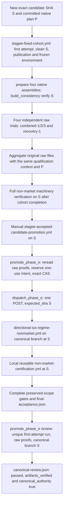

# Stage-E Lane D: canonical native-transition wiring audit

PAPER ONLY. The native wiring is blocked pending required source. Stage E has not
been run by this lane; Stage F has not been run by this lane. This package is a paper descendant
of the supplied production reference. It is not an integrated successor or a
qualification receipt.

Production reference: `dc08f9064cf5e37b63f383f52aa709d0afc1723f`.
Production tree: `68736cf664169dee665762019800bf87ca0f1f67`.
Publication branch: `cert/stage-e-native-wiring`.

The exact paper commit/tree are the Git objects published on that branch and
reported in the final handoff. The future integrated candidate SHA/tree remain
unset. The paper commit uses the production reference as its sole parent; no
rejected or diagnostic branch is an ancestry input.

## Required source and why readiness is blocked

The required identity is `stage-e-native-transition-contract-v1`, including
`native-transition-cohort-v1` and `native-contract-held-reader-v1`.
The supplied production tree exposes only `maintenance_qualification.py`,
the E26 plan, and predecessor lifecycle/reader implementations. Its raw trial,
aggregation, promotion re-verification and full combined-pressure reader all
select predecessor paths.

No preserved native v1 entrypoint, plan, witness/reader implementation, raw
verifier schema, or associated deterministic tests was located in the inspected
reachable trees or supplied as an accessible package. The diagnostic branches
describe the capability to recreate but do not contain that implementation.
The transport snapshot contains a validator without request/payload bytes.

The historical rejected object `06f7a129eb9a1deab02af5f1f6bdfbaea89ea142`
returns GitHub 404; tree `90839dfc47c1665e8d84eea62e6ba95e5e369efd`
returns 422. These are archival source locators only. This package does not use
them as parents, assert that their contents were read, or require their ancestry
for a future implementation.

All 431 listed branch names, eight relevant reachable snapshot trees, the
production tree, and reachable entrypoint/plan/workflow history were inspected
within the scope recorded in [STATIC_AUDIT.json](STATIC_AUDIT.json). Default-branch
code searches and commit searches returned no native identity source. These
searches do not establish absence from all history or external storage.
A source-location clarification was requested; no source location was available
when this paper package was prepared.

The historical 34/34 witness/reader/integration, 79/79 Pump, 79/79 Meteora,
336/336 pinned deterministic suite and reported below-1% measurements remain
user-reported historical evidence. Their raw bytes were not independently
reverified here. They do not certify a future candidate. A local 4,445-frame run
has no canonical Stage-E authority.

Recreating v1 from only those names and test counts would invent its raw
identity/acceptance contract. No substitute implementation or revision label
has been introduced.

## Authoritative path on the production reference

The fixed cohort is a prerequisite to canonical certification. Its recovery
trial is not itself the canonical Stage-E run.



The future native selectors in A/D/E/F/K/M are **not prepared by this package**.
The observed code selects the predecessor in those edges.

1. The [fixed-cohort workflow](https://github.com/levonmendall/The-Meme-Machine/blob/dc08f9064cf5e37b63f383f52aa709d0afc1723f/.github/workflows/stagee-fixed-cohort.yml#L1)
   checks event SHA = expected SHA = checkout HEAD, attempt 1, clean Git status,
   reviewed parent and exact changed-file set, plan SHA-256, paper-only authority,
   and Git object integrity. The current push scope is
   `repair/stagee27-archive-ready-allocation-20260928`; manual dispatch takes
   `expected_sha`. The old publication request cannot describe a new successor.
2. It installs frozen Python `3.12.14` / websockets `17.1`; the
   [environment gate](https://github.com/levonmendall/The-Meme-Machine/blob/dc08f9064cf5e37b63f383f52aa709d0afc1723f/certification/qualification_environment.py#L10)
   also requires policy predecessor
   `af60b355995dfa960555288fa73808bb7aba5d25` to be available.
3. `python -m certification.run prepare --worktrees <runner-temp>/cohort-lanes`
   constructs all four pinned lane sources. `build_consistency verify` binds
   these to the integration SHA before pressure and focused regressions.
4. Four independent matrix trials call:
   `python -m certification.maintenance_qualification --trial "$TRIAL" --output <fresh-directory>`.
   The [entrypoint](https://github.com/levonmendall/The-Meme-Machine/blob/dc08f9064cf5e37b63f383f52aa709d0afc1723f/certification/maintenance_qualification.py#L13)
   sets `stagee24_qualification_plan.json`, LifecycleObserver, durable reader
   Interaction and stricter hot/retained-age acceptance through its context.
   The [driver](https://github.com/levonmendall/The-Meme-Machine/blob/dc08f9064cf5e37b63f383f52aa709d0afc1723f/certification/cleanup_recovery.py#L328)
   rejects changed frozen inputs and creates fresh output directories.
5. Aggregation recovers all preflight/trial artifacts from the same run, checks
   environments, and calls `cleanup_recovery.aggregate(root, sha)` under that
   same qualification context. It requires every trial job to succeed and
   every raw trial to pass. An aggregate summary alone is insufficient.
6. The candidate must then pass full preserved-scope machinery verification on
   exactly S. Promotion requires its run to start after the fixed cohort
   completed. The workflow registration/default branch may expose dispatchers;
   executing source and locally referenced reusable workflows must be at S.
7. The manual
   [promotion wrapper](https://github.com/levonmendall/The-Meme-Machine/blob/dc08f9064cf5e37b63f383f52aa709d0afc1723f/.github/workflows/stagee-accepted-candidate-promotion.yml#L1)
   invokes
   [promote_phase_e](https://github.com/levonmendall/The-Meme-Machine/blob/dc08f9064cf5e37b63f383f52aa709d0afc1723f/certification/promote_phase_e.py#L83).
   It re-evaluates original trial files and full final acceptance, checks
   exact-SHA successful first-attempt runs/jobs, pinned artifact IDs/digests,
   frozen environment, implementation/manifest/native-diff identities, and
   then checks those runs/artifacts again after reading.
8. After a durable remote intent, an ancestor-checked compare-and-swap promotes
   exactly S to `cert/autonomous-paper-machinery-20260927`. The
   [dispatcher](https://github.com/levonmendall/The-Meme-Machine/blob/dc08f9064cf5e37b63f383f52aa709d0afc1723f/certification/dispatch_phase_e.py#L164)
   posts once to `directional-six-regime-nonmarket.yml` with
   `expected_sha=S`. Branch movement, duplicate/active runs, a different
   runtime SHA or differing reusable-workflow SHA blocks the flow.
9. The canonical
   [wrapper](https://github.com/levonmendall/The-Meme-Machine/blob/dc08f9064cf5e37b63f383f52aa709d0afc1723f/.github/workflows/directional-six-regime-nonmarket.yml#L1)
   calls local
   [non-market-certification.yml](https://github.com/levonmendall/The-Meme-Machine/blob/dc08f9064cf5e37b63f383f52aa709d0afc1723f/.github/workflows/non-market-certification.yml#L1)
   with `preserved_only: true` and the expected SHA. It prepares/verifies
   complete assemblies before the existing durability and offline gates.
10. [Final acceptance](https://github.com/levonmendall/The-Meme-Machine/blob/dc08f9064cf5e37b63f383f52aa709d0afc1723f/certification/final_acceptance.py#L91)
    must produce `CERTIFIED_NON_MARKET_ENGINEERING` with all required gates,
    `validation_scope=preserved_evidence_only`, exact integration SHA and
    paper-only/no-live-money authority. A successful Actions conclusion does
    not itself establish canonical acceptance.
11. [Canonical review](https://github.com/levonmendall/The-Meme-Machine/blob/dc08f9064cf5e37b63f383f52aa709d0afc1723f/certification/promote_phase_e.py#L297)
    waits read-only, verifies the unique new canonical run and current canonical
    branch SHA, retrieves/recomputes raw evidence under the same plan and
    qualification context, and writes `canonical-review.json` with
    `passed=true`, `artifacts_verified=true`, `canonical_authority=true`.
    Failure preserves raw artifacts and does not authorize another POST.

## Workload and acceptance that must be retained

The inspected plan is `e26-eligible-hot-debt-v1`, SHA-256
`b7ff1c305e6df7eeab2b20b57e6f1e9211a2642dadc893208012d3042858696e`.
It binds eight unchanged workload/acceptance inputs and four observation sources.
All twelve current digests match; this says nothing about a future native plan.

The unchanged cohort contains three 2,223-frame combined trials
(600.21 source seconds each) and one 4,445-frame recovery trial
(1,200.15 source seconds). Preserve the .27-second source schedule, seeds,
preserved event bodies, burst source coordinates 216/378, original eight-second
pauses at frame 800/1,400, .165 owner seconds/frame, .36 archive seconds/thousand,
.006 added commit latency, five-second samples and original reader/tail delays.
No retries or source-clock refresh is permitted.

Retain all predecessor evidence unless a reviewed native path explicitly proves
an equivalent or stronger contract: all scopes' archive-eligible hot and archived
retirement recovery/debt tails; durable record service; genuine held-reader
source and retirement overlap; resources/integrity/zero provider calls; source
lag <45; hot and retained residence strictly <240; 120-source-second recovery;
pipeline slack 1,000 and original decline/trend bounds; native frame/byte/
transaction/worker limits; urgent/source fairness and checkpoint completion.
Active native transitions must use actual owner observations and mutators, not
fabricated demand vectors presented as integrated evidence.

The broader dispatch-required gates remain: exact source offline suites, native
crash matrix, restart safety, integrated current policy, historical exposure
resolution and released registry, resource bounds, mature Solana pressure,
combined mature pressure, joined eight-day system, exact integration identity,
six-regime integration, preserved production-adapter contracts and bounded
preserved validation. Preserve protocol freeze, prepared import/test collection,
provider-removal and historical raw-evidence checks as well.

## Assembly and every observed SHA/tree binding

[run.prepare](https://github.com/levonmendall/The-Meme-Machine/blob/dc08f9064cf5e37b63f383f52aa709d0afc1723f/certification/run.py#L503) checks pinned native source
files, applies declared patches, copies exact integration overlays, stages them
and checks the staged diff. A prepared native worktree intentionally has a
reviewed staged overlay relative to its native base; that is accepted only when
its complete declared diff matches the committed manifest. Arbitrary dirt is
not part of that assembly.

[build_consistency](https://github.com/levonmendall/The-Meme-Machine/blob/dc08f9064cf5e37b63f383f52aa709d0afc1723f/certification/build_consistency.py#L204) checks
integration HEAD, all four composed sources, policy/protocol, frozen pressure
bytes, local module origins and native test collection. Reviewed source/protocol
refresh is anchored at `23f06ed84e5b5e2d4efd074618ab44ae7ed58011`; both generated
manifests must be committed together. This lane does not refresh runtime
manifests or repair source.

| Boundary | Observed binding | Limit / successor obligation |
|---|---|---|
| Published Git object | Commit S identifies its immutable Git tree T | Paper publication preserves all existing blob IDs and modes; future S/T still unset. |
| Fixed preflight | event SHA = expected SHA = HEAD; HEAD tree/parent recorded; clean status; reviewed file set; plan hash | Publish a new request matching the actual successor parent/files/native plan. |
| Environment | exact Python/dependency versions and reachable policy predecessor | Earn fresh environment receipts for every relevant run. |
| Root qualification inputs | unchanged-input and observation-source SHA-256 maps | Include every native entrypoint/observer/verifier input in the new plan; no stale v1 summary. |
| Native source bases | Pump `3c9553afb3caa92ab5f3db769f870df033a9630f`; Meteora `a3579b4cc748fdbb7b4a466680f8a224773adc8b`; Pons `3de3d376847531ccb90e260cfcc96c37587ccb23`; Ramses `41b5f263efc31bedf9b39039a9f66bed264b70d3` | These native base SHAs are composed under integration S; none substitutes for S. |
| Native assembly | source_manifest_hash, source_diff_sha256, composed-file hashes, overlay equality and import origins | New native tests must be collected on both required assemblies; all consumed runtime bytes must match the verified assembly. |
| Raw trial | trial metadata and raw result integration_sha = S; exact plan bytes; unique trial paths | Add/verify native witness, held-reader and observer identities tied to S/T/assembly/run/attempt. |
| Aggregate | recompute each raw result under the identical plan/context | Updating the trial command alone would leave predecessor acceptance active. |
| Full non-market evidence | exact S, implementation_hash, manifest hash and each lane diff hash | Retain every existing complete gate and independently verify native evidence. |
| Artifact transport | unique artifact name, ID, SHA-256 digest and workflow run ID; exact successful source run; post-read recheck | Reject wrong candidate, plan, assembly, run/attempt, missing raw data and changed artifacts. |
| One-use intent | remote ref keyed by exact S, raw cohort/build digests, artifact references, plan digest | Never reserve from historical green evidence; no intent was reserved here. |
| Promotion/dispatch | ancestor check; expected-old-SHA CAS; canonical ref = S; dispatched runtime = S | Equal trees with different commits are insufficient. Branch race burns intent and stops. |
| Canonical run/review | exact head SHA/branch/event/attempt/path; reusable SHAs = S; unique post-intent run; final canonical ref = S | Canonical authority requires terminal raw review under the same native context. |

The lane diff SHA-256 values and all inspected file/tree object identities are
recorded in STATIC_AUDIT.json.

### Requested future guarantee is not yet proved

The existing same-SHA checks are substantial, but this package cannot prove the
requested future native execution guarantee.

The fixed trial command has no prepared-worktree argument. Its build preflight
runs in a different job; trial execution imports the root qualification/pressure
modules. No inspected receipt proves that trial-consumed native code is the same
assembled code verified in preflight. This is a qualification binding gap, not
a demonstrated runtime defect.

Root `git status --porcelain` and integration integrity checks do not by themselves
establish all imported root module origins: status excludes ignored files, while
the integration integrity check covers certification/workflows and lane assembly
checks cover lane worktrees. A successor must fail closed on tracked mutations,
untracked/ignored executable shadowing, wrong imports, foreign local source and
unassembled execution across the actual qualification subprocesses.

Once source is available, require non-workload rejection tests for qualified S /
execution S2 (including equal trees), dirty/ignored-shadow source, substituted
root modules, absent/drifted assembly, changed plan/manifest, stale foreign-SHA
artifacts, duplicate/missing trials, wrong reusable SHA, run/attempt drift,
artifact replacement and canonical branch races. Require positive dry
construction showing one native plan/context and one S/T/assembly identity from
trial through canonical raw review. These are required future tests; none is
represented as having run here.

## Wiring/entrypoint diff and minimal remaining edges

**Executable workflow and entrypoint diff: empty. Runtime/manifest diff: empty.**
Only the paper package files change. No canonical selector was changed because
the required native source and raw verification contract are unavailable.

| Current edge | Minimum reviewable successor change after source recovery |
|---|---|
| Fixed trial -> maintenance_qualification | Select the reviewed native v1 entrypoint/plan; prepare/verify and bind the actual consumed assembly in each execution job. |
| Fixed aggregate -> predecessor qualification context | Import the same native plan/frozen-input checks/context and independently re-evaluate original native witnesses/readers plus retained predecessor evidence. |
| Promotion verify_evidence/review -> predecessor context | Recompute the same native raw schema and verify S/T/plan/assembly/run/digest bindings before reserving authority and after canonical completion. |
| Full durability -> combined_observer; final acceptance -> its verified() | Add the native revision explicitly, retaining these broader gates until equivalent/stronger evidence replaces any predecessor component. |
| Publication request and manifest discovery | Commit a new parent/file/plan request and qualification-source identities; include required native tests in actual Pump/Meteora assembly collection. |
| Observer acceptance | Require a fresh applicable exact-candidate receipt and strict less-than comparator; test equality/malformed evidence rejection. |

Exact native module filenames, callable signatures and raw keys cannot be
truthfully supplied before reading the preserved implementation/schema. This
table is a binding map, not an executable patch or a readiness claim.

## Strict observer requirement

The predecessor [lifecycle observer](https://github.com/levonmendall/The-Meme-Machine/blob/dc08f9064cf5e37b63f383f52aa709d0afc1723f/certification/lifecycle_capacity.py#L161)
uses `ratio <= .01`. The requested contract is **strictly less than 1%**.
A future native path must reject equality, nonfinite/missing/malformed measurements
and measurements that do not apply to the exact integrated candidate.

Changed runtime, qualification hooks, reader/witness accounting, assembly,
environment or workload inputs must trigger a newly applicable measurement.
Record exact S/T, assembled-source/plan identities, environment, numerator,
denominator, measured applicable observer costs and raw timing evidence.
Account for all applicable qualification observation costs without double-counting
overlapping intervals. Extra diagnostic instrumentation is separate evidence.

Historical measurements are not attached automatically. Historical green counts
cannot certify the future observer. This lane ran no observer benchmark.

## Verification performed

The same pure audit function packaged in [static_audit.mjs](static_audit.mjs)
was executed in isolated JavaScript against exact-SHA GitHub file bytes.
All **37 textual structural/identity assertions passed**. All **12 frozen-input
digests matched**. **31 inspected file blobs** matched their Git SHA-1 and byte
lengths; all **50 base Git tree object hashes**, including the production root,
were reconstructed from modes/names/object IDs and matched. Five standard
SHA-1/SHA-256 test vectors verified the digest implementation used for this audit.
All four current lane diff identities agree between source and protocol manifests.
Seven in-memory negative checks of the static audit rejected missing SHA forwarding,
an omitted recovery trial, changed plan/input bytes, a removed candidate guard,
a foreign aggregate context and mismatched native/protocol diff identities.
These exercise the static checker only; they are not native execution rejection tests.

This is a static source trace. It is not YAML schema/actionlint validation, native
Python/SQLite execution, build preparation, import collection, deterministic
native v1 qualification, a clean local-worktree/Git-fsck proof, capacity
qualification, observer qualification, canonical Stage E or Stage F.

A clone containing the production object can reproduce the structural/digest
audit with:

```sh
node docs/stage-e-native-wiring/static_audit.mjs
```

The script uses read-only `git show <pinned-sha>:<path>` calls. It runs no Python,
pressure, native assembly or GitHub dispatch and writes only JSON to stdout.
Exit zero means the predecessor trace assertions passed; the JSON explicitly
retains `qualification_wiring_ready=false`.

## Package and remaining activation steps

Changed files:

- `docs/stage-e-native-wiring/README.md` — path, source blocker, binding audit,
  observer requirement and future steps.
- `docs/stage-e-native-wiring/STATIC_AUDIT.json` — exact source hashes, 37 checks,
  all 50 tree reconstructions, search snapshots and explicitly unproved requirements.
- `docs/stage-e-native-wiring/static_audit.mjs` — reproducible read-only predecessor audit.
- `docs/stage-e-native-wiring/SHA256.json` — hashes of these three package artifacts.

Remaining, unexecuted:

1. Expose preserved native v1 source/plan/schema/tests, or an owner-reviewed
   replacement specification sufficient to recreate the exact contract. Verify
   preserved file bytes/modes independently; use truthful ancestry from reachable
   production. Historical rejected ancestry is unnecessary.
2. Recreate only qualification instrumentation, evidence verifiers and entrypoint
   plumbing. If that requires runtime semantics, stop for the cross-lane conflict.
   Do not implement owner admission, M1, housekeeping or production preflight repair.
3. Wire every mapped edge, publish accurate native plan/source/assembly identities,
   and keep all predecessor/full gates and unchanged workload limits.
4. Run static workflow/schema validation, deterministic native qualification,
   plan/manifest/identity and dry construction/rejection tests in an environment
   capable of native execution. Resolve source-binding proof gaps before readiness.
5. Integrate the other authorized lanes into a new exact committed candidate S/T,
   verify clean input and complete assemblies, and earn all applicable deterministic
   evidence and the strict <1% observer receipt afresh for S. A new SHA requires
   new same-SHA evidence; do not copy historical passes.
6. Only under future activation authority, execute the unchanged fixed cohort,
   then the full exact-SHA machinery prerequisite. Recompute complete raw proofs.
   Only then consider the dedicated one-use promotion/canonical dispatch flow
   and terminal raw acceptance review. This mission does not authorize those actions.

The remote intent boundary is atomic creation of
`refs/heads/cert/phase-e-dispatch-intent-<S>` before push/POST. Lost or ambiguous
responses consume the intent; reconciliation is GET-only. Do not create an
intent, change the canonical branch, dispatch Stage E, start Stage F or merge
as part of this paper handoff.
