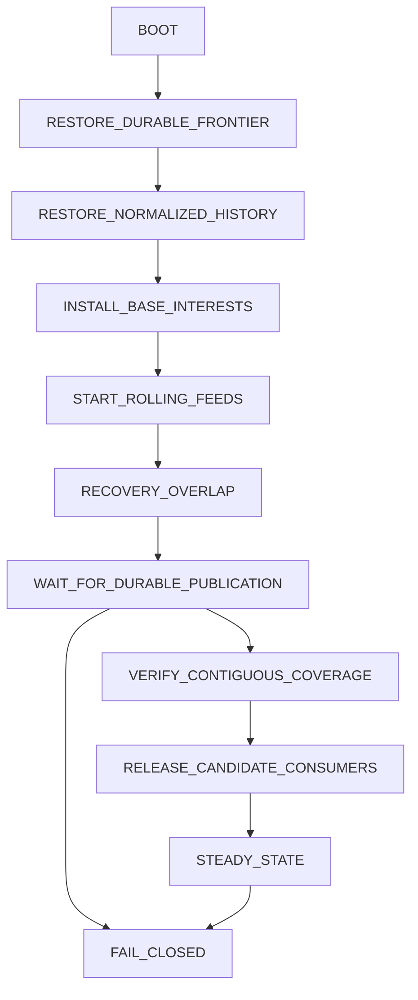

# Active Solana startup

MODEL B — ROLLING NORMALIZED PREWARM is the only active startup implementation. MODEL A is archived at `c8a980b69ca1d26a1d72e8554bc32fc9f73e8932`; it is not a runtime fallback. The persistent PAPER guard remains closed while simultaneous capacity is unproved.

`solana_evidence_service.serve` requires an explicit Model B driver. `SelectiveSource.run` uses the shared priority owner for provider intake, normalized publication, subscription membership and recovery progress. Both old lane-local service entrypoints delegate to that owner. The former default broad transport producer, historical startup planner and nested repair dispatcher have been removed. Legacy decoder/storage fixture methods do not start a provider producer.

The durable startup phases are:

Every transition has a session, sequence, timestamp, canonical body and hash in the canonical SQLite database. Restart creates a new startup session, restores the last durable candidate checkpoint and repeats overlap verification. It does not reset any candidate or work deadline. A socket ACK, elapsed time, state checkpoint or empty interval cannot fabricate economic coverage. Missing startup state fails the consumer release check.

Fresh boot acknowledges both filtered Pump/PumpSwap log feeds and observes their first real finalized deliveries before choosing the start boundary. It excludes the potentially partial first delivered slot. Native status/meta ordering and complete log-message coverage must join and durably publish before release. A restart begins overlapping replay at checkpoint minus one. Only missing old log messages within the proven restart interval may need selective RPC; the regular body-free path remains active.

The shared canonical SQLite database owns `rolling_economic_events`. Its schema retains identity, scope, slot, transaction signature, transaction index, event index, program, market timestamp, economic kind, normalized body/hash, first availability and optional cold reference. Address and provenance tables provide lookup and authentication. Events in one slot remain distinct. CandidateHistory stores canonical references and lifecycle/work metadata; Current, Survivor, recovery and research share the event body. Migration preserves existing immutable hashes and availability times.

Pump/PumpSwap use filtered program logs and native filtered status/meta/finality. Transaction bodies are not the normal evidence unit. Meteora uses structural account discovery and scoped native minimum economic packets from first sight. Stable WSOL policy membership is retained independently of promotion. Required authoritative account state is checkpointed from existing reads; quiet candidates do not cause broad account/bin snapshots. Checkpoints identify scope, candidate, slot, market time, canonical proof, history frontier, availability and exact state fields. They do not seal history. Immutable address fields may be reused within the existing 20-second freshness boundary; current state still receives required fresh reads.

Promotion first queries rolling coverage. Authenticated creation establishes the Pump lower boundary. A recent scout observation without its already-arriving creation event persists a boundary wait; the publisher resolves it without cold reconstruction. Even after creation is authenticated, an upper bound beyond durably published coverage persists a publication wait. A closed gap and an unpublished tail in the same request are treated separately. Missing work history at the current rolling tail also waits. Closed gaps request only their exact missing interval, with explicit recovery, late-discovery, checkpoint, provider or missing-field reason. A failed Model B startup never invokes Model A.

Retention follows existing strategy horizons: ungraduated Pump trajectory has no invented finite cutoff; graduation preserves the Survivor maximum age of seven days. Meteora retains the required 120-second trigger, 12-second warmup and 20-second current-state span, extended by active consumers. Open/reserved positions, continuation, HWM, bridge, staged adds, deadlines, pending replay, gaps and durable audits prevent premature retirement. Candidate identity and compact history remain durable. Cold references are verified and readable after restart.

Membership is identified by physical desired group/version, not every repeated scouting observation. A revision changes only when relevant durable state changes. Unchanged plans issue no owner mutation or subscription replacement. State setting may coalesce; economic events and decisions do not. Queue-full rejection occurs before admission, so a producer retains its command and waits with bounded exponential delay. Accepted work survives waiter cancellation. Safety/open-position priority and immutable request/deadline semantics remain intact.

This implementation has passed deterministic startup, publication-race, exact-gap, restart, ordering and lossless pressure regressions. The final live capture reached steady state but later failed closed and did not establish complete simultaneous candidate and position prerequisites. The archive remains non-active; capacity and monthly operating cost remain uncertified. See [REPORT.md](REPORT.md) for the exact evidence and remaining proof.
